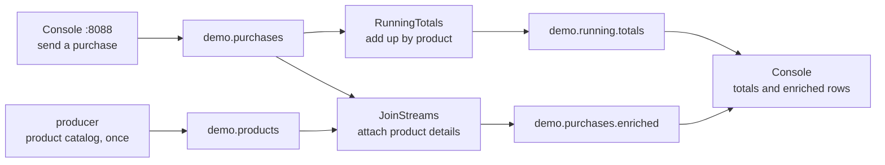
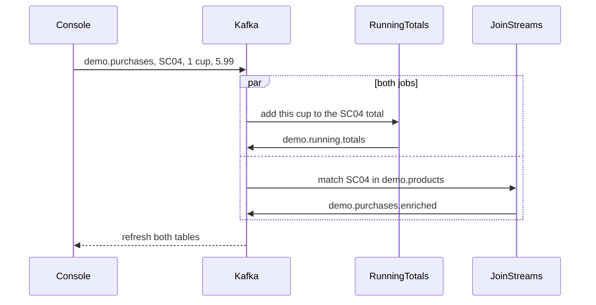
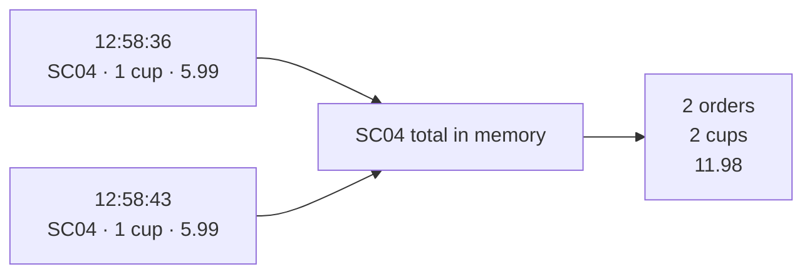
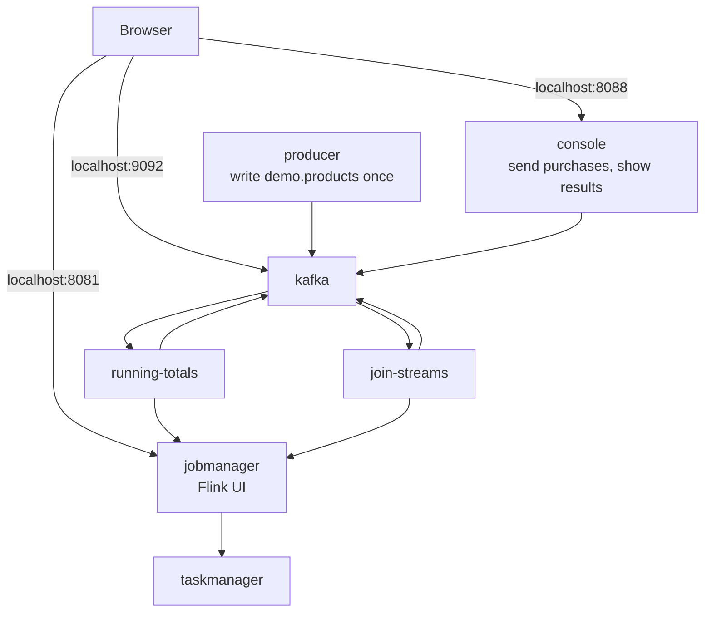

# Apache Flink / Apache Kafka Streaming Analytics Demo

A small Java demo of streaming sales analytics. Purchases go into Kafka. Two Flink jobs keep a running sales total per product, and attach product details to each purchase.

The product catalog follows the [Streaming Synthetic Sales Data Generator](https://github.com/garystafford/streaming-sales-generator). This repository runs the jobs with its own Docker Compose stack: Kafka 3.7 (KRaft), Flink 1.19.1, a one-shot catalog producer, and a web console.

## What you are looking at

The console sends a purchase. Kafka holds it. Flink updates two results, and the console shows both.



| Job | Reads | Writes |
| --- | --- | --- |
| `org.example.RunningTotals` | `demo.purchases` | `demo.running.totals` — transaction count, quantity, and sales per product |
| `org.example.JoinStreams` | `demo.products`, `demo.purchases` | `demo.purchases.enriched` — each purchase plus product name, category, and cost |

One purchase is handled by both jobs at the same time:



`RunningTotals` does not scan old orders. It keeps one total per product and adds the new cup to it:



| Time | New purchase | SC04 total after this purchase |
| --- | --- | --- |
| 12:58:36 | 1 cup, 5.99 | 1 order / 1 cup / 5.99 |
| 12:58:43 | 1 cup, 5.99 | 2 orders / 2 cups / 11.98 |

## Learn

Longer beginner notes, in Chinese, with more diagrams:

* [统计销量，为什么不直接用数据库？](docs/database-vs-flink.md) — the same sales question, answered with a database query or with this pipeline
* [Flink 怎么读 Kafka](docs/flink-kafka-topology.md) — how one purchase moves from a topic to a running total

## Quick start

Requires Docker Compose. One command starts the boxes in the diagram below.



```shell
docker compose up --build -d
```

That starts Kafka, writes the product catalog once when `demo.products` is empty, starts Flink, and submits both jobs.

- Console: <http://localhost:8088> — send a purchase and watch the totals
- Flink UI: <http://localhost:8081>
- Kafka from the host: `localhost:9092`

Inside the Compose network, jobs use `kafka:29092`. `BOOTSTRAP_SERVERS` on the job containers overrides `src/main/resources/config.properties`.

```shell
# running totals written by org.example.RunningTotals
docker compose exec kafka /opt/bitnami/kafka/bin/kafka-console-consumer.sh \
  --topic demo.running.totals --from-beginning --bootstrap-server localhost:9092

# enriched purchases written by org.example.JoinStreams
docker compose exec kafka /opt/bitnami/kafka/bin/kafka-console-consumer.sh \
  --topic demo.purchases.enriched --from-beginning --bootstrap-server localhost:9092

docker compose down
```

Send purchases from the console. The `producer` service only seeds the catalog. Point `BOOTSTRAP_SERVERS` at another broker if you want the same jobs to read an existing Kafka cluster.

After a code change, rebuild and submit again:

```shell
docker compose up --build -d
```

The submit containers skip a job that is already running under the same name. Cancel it in the Flink UI first if you need a fresh submission.

## Message samples

Purchase on `demo.purchases`:

```json
{"transaction_time": "2022-09-13 12:58:36.915834", "transaction_id": "2883033696701592101", "product_id": "SC04", "price": 5.99, "quantity": 1, "is_member": false, "member_discount": 0.0, "add_supplements": false, "supplement_price": 0.0, "total_purchase": 5.99}
```

Running total on `demo.running.totals` after many purchases, not just the two cups above:

```json
{"event_time":"2022-09-10T02:44:03.962799Z","product_id":"SC04","transactions":52,"quantities":65,"sales":432.06}
```

Enriched purchase on `demo.purchases.enriched`. The purchase only carried `product_id`; the name and category came from `demo.products`:

```json
{"transaction_time":"2022-09-13 12:50:55.644564","transaction_id":"1142152017802750696","product_id":"CS06","product_category":"Classic Smoothies","product_name":"Blimey Limey","product_size":"24 oz.","product_cogs":1.50,"product_price":4.99,"contains_fruit":true,"contains_veggies":false,"contains_nuts":false,"contains_caffeine":false,"purchase_price":4.99,"purchase_quantity":1,"is_member":false,"member_discount":0.00,"add_supplements":false,"supplement_price":0.00,"total_purchase":4.99}
```

## Flink UI


Short [YouTube video](https://youtu.be/ja0M_2zdbfs) of the original demo (video only, no audio).

## Kafka commands

```shell
docker compose exec kafka bash

export BOOTSTRAP_SERVERS="localhost:9092"

kafka-topics.sh --list --bootstrap-server $BOOTSTRAP_SERVERS

kafka-topics.sh --describe \
  --topic demo.running.totals \
  --bootstrap-server $BOOTSTRAP_SERVERS

kafka-console-consumer.sh \
  --topic demo.purchases --from-beginning \
  --bootstrap-server $BOOTSTRAP_SERVERS
```

Topics are created by the producer on startup: `demo.products`, `demo.purchases`, `demo.purchases.enriched`, `demo.running.totals`.

## Build the jar on the host

Compose builds the uber JAR inside the job image. To build it locally, use JDK 11:

```shell
./gradlew clean shadowJar
```

The JAR is `build/libs/flink-kafka-demo-1.2.0-all.jar`. Flink dependencies are `compileOnly` and must match the Flink 1.19.1 cluster.

## References

* <https://www.baeldung.com/kafka-flink-data-pipeline>
* <https://github.com/eugenp/tutorials/tree/master/apache-kafka/src/main/java/com/baeldung/flink>
* <https://github.com/apache/flink/blob/master/flink-examples/flink-examples-table/src/main/java/org/apache/flink/table/examples/java/basics/StreamSQLExample.java>

---

_The contents of this repository represent my viewpoints and not of my past or current employers, including Amazon Web
Services (AWS). All third-party libraries, modules, plugins, and SDKs are the property of their respective owners. The
author(s) assumes no responsibility or liability for any errors or omissions in the content of this site. The
information contained in this site is provided on an "as is" basis with no guarantees of completeness, accuracy,
usefulness or timeliness._
