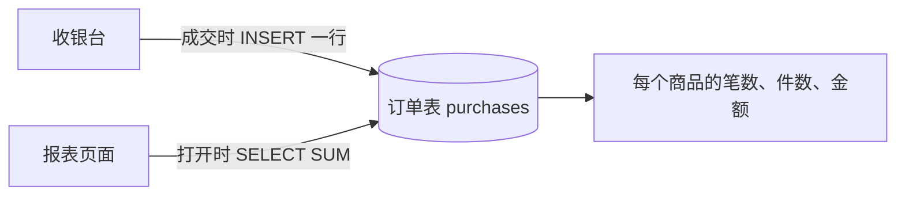
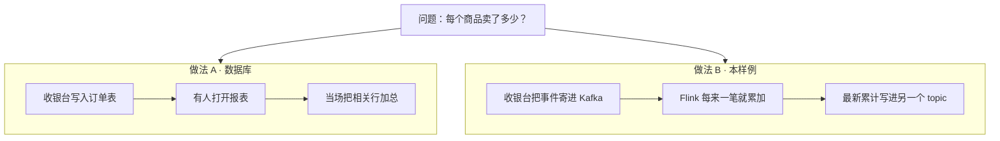
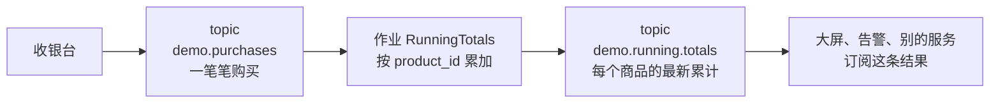
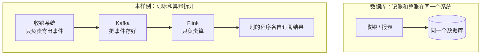
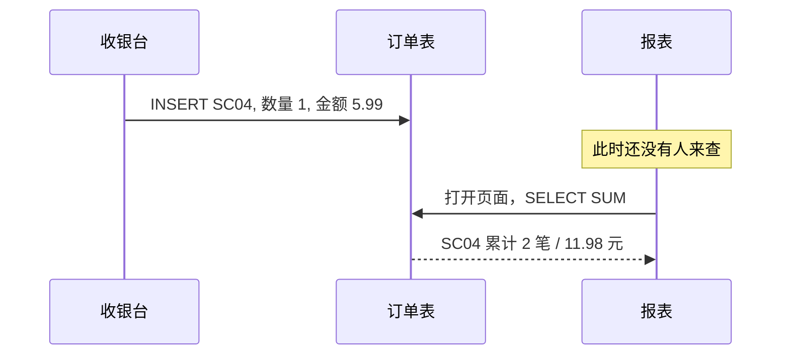
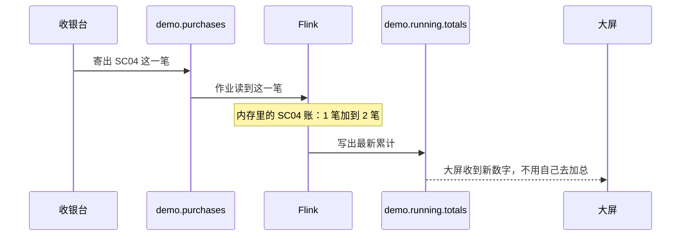
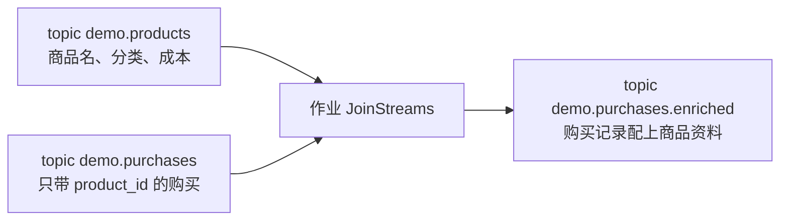
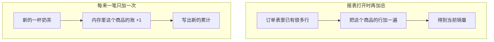
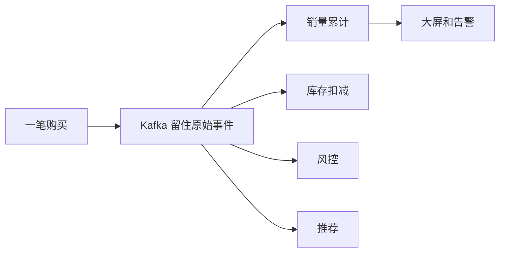

# 看图理解：统计销量，为什么不直接用数据库？

可以。这个样例要回答的问题是「每个商品卖了多少」，用后端数据库存一笔、再算一笔，完全够用，而且更简单。

这里把两套做法并排摆开，方便看清：数据库是在有人来查的时候算账；本仓库是数据一来就接着算，并把最新结果继续往下传。

相关阅读：[Flink 怎么读 Kafka](flink-kafka-topology.md)。

## 1. 这个样例在算什么

收银系统不断寄出购买记录，一条类似这样：

```json
{"transaction_time": "2022-09-13 12:58:36.915834", "transaction_id": "2883033696701592101", "product_id": "SC04", "quantity": 1, "total_purchase": 5.99}
```

`RunningTotals` 按商品编号把三样东西累加起来：卖了多少笔、多少件、多少钱。结果写成另一条消息：

```json
{"event_time": "...", "product_id": "SC04", "transactions": 52, "quantities": 65, "sales": 432.06}
```

用两笔 `SC04` 看累加过程：

| 时间 | 新来的一笔 | 这个商品此刻的累计 |
| --- | --- | --- |
| 12:58:36 | 1 件，5.99 元 | 1 笔 / 1 件 / 5.99 |
| 12:58:43 | 又 1 件，5.99 元 | 2 笔 / 2 件 / 11.98 |

后来每一笔都只在上一行的数字上加，不用把历史订单重新加一遍。

## 2. 数据库怎么算出同样的数字

收银台成交时插入一行，报表打开时再汇总：

```sql
INSERT INTO purchases (product_id, quantity, total_purchase)
VALUES ('SC04', 1, 5.99);

SELECT product_id,
       COUNT(*)            AS transactions,
       SUM(quantity)       AS quantities,
       SUM(total_purchase) AS sales
FROM purchases
GROUP BY product_id;
```

商品就几十种、每秒几笔订单时，这条查询很快。页面刷新一次，销量就有了。



也可以不等查询，每插入一笔就改累计表，效果和 Flink 的累加一样：

```sql
INSERT INTO product_stats (product_id, transactions, quantities, sales)
VALUES ('SC04', 1, 1, 5.99)
ON CONFLICT (product_id) DO UPDATE
SET transactions = product_stats.transactions + 1,
    quantities   = product_stats.quantities + EXCLUDED.quantities,
    sales        = product_stats.sales + EXCLUDED.sales;
```

## 3. 两条路并排看

同一个问题，两条流水线：



本样例对应的具体信箱：



代码里就是：每笔购买先记成「1 笔，加上本笔的件数和金额」，再按商品编号分组累加，最后写回 Kafka。对应 `src/main/java/org/example/RunningTotals.java`：

```java
DataStream<RunningTotal> runningTotals = purchases
        .keyBy(RunningTotal::getProductId)
        .reduce((runningTotal1, runningTotal2) -> {
            runningTotal2.setTransactions(
                    runningTotal1.getTransactions() + runningTotal2.getTransactions());
            runningTotal2.setQuantities(
                    runningTotal1.getQuantities() + runningTotal2.getQuantities());
            runningTotal2.setSales(
                    runningTotal1.getSales().add(runningTotal2.getSales()));
            return runningTotal2;
        });
```

`keyBy(商品编号)` 的意思是：同一个商品的账，始终交到同一个人手上加。奶茶的账不会和咖啡的账混在一起。搬家细节见 [Flink 怎么读 Kafka](flink-kafka-topology.md)。

## 4. 差别在什么时候算、结果交给谁

| | 数据库 | 本样例 Kafka + Flink |
| --- | --- | --- |
| 原始记录放哪 | 订单表里的一行 | Kafka 里按时间排好的购买事件，可以重放 |
| 什么时候算 | 有人查询，或定时任务跑的时候 | 每来一笔立刻累加 |
| 结果放哪 | 查出来的一张表 | 持续更新的 `demo.running.totals` |
| 谁来用 | 连这个库的后端和报表 | 任何订阅这条结果的程序 |
| 统计口径改了 | 用留下的订单重新 `SELECT` | 用留下的事件把作业重跑一遍 |

记账和算账放在一起，还是拆开，可以画成这样：



拆开之后，算账的人变慢或重启，不影响收银台继续寄信。信还在 Kafka 里，会计回来可以从头把账补上。

## 5. 沿着一杯奶茶走一遍

假设 12:58:43 卖出一杯 `SC04`，单价 5.99。

数据库里发生的事：



本样例里发生的事：



两种做法得到的数字相同。数据库等报表来问；Flink 算完就把新数字推出去。

## 6. 第二件事：给购买记录配上商品名

购买消息里只有 `product_id`，例如 `SC04`。商品名称、分类在另一份商品资料里。

数据库用一次连接：

```sql
SELECT p.transaction_id, p.product_id, d.item, d.category, p.total_purchase
FROM purchases p
JOIN products d ON d.product_id = p.product_id;
```

本样例的 `JoinStreams` 订两个信箱，在流动中把它们拼成一条更完整的购买记录，写到 `demo.purchases.enriched`：



拼好之后，一条消息里同时有「卖了什么」和「这是哪一种饮料」。后面的统计如果要按品类汇总，就不用再回头查商品表。

## 7. 两种算法，量小的时候看不出差别

商品种类少的时候，每次查询把相关行加一遍也很快。购买变成海量以后，差别才明显：查询要扫过越来越多的历史；流计算只处理新到的这一笔。



门店或普通后台里，左边已经够用。每秒成千上万笔、还要连续推给大屏时，右边更合适。

## 8. 什么时候用数据库

下面这几条都成立时，订单进数据库、报表直接查库，就是合适的做法：

- 订单本身要落库：要对账、要改单、要按用户查历史。
- 统计是给人看的报表：今天、本周、某个品类，打开页面时再汇总。
- 量级是门店或普通电商，单库扛得住。
- 用这份结果的主要是自己的后端，没有一大批外部程序同时订阅。

很多系统就是这样运行的：白天订单进 MySQL 或 PostgreSQL，报表查这张表，或者夜里再同步到数仓。

## 9. 什么时候用 Kafka + Flink

同一笔购买进来之后，有很多件事要同时发生，而且结果要一直保持最新，这条链路才值回它的复杂度：



适合它的情况：

- 销量、库存、风控、推荐都要看同一笔购买，又不把这些逻辑都压在订单库上。
- 每秒成千上万笔，每次查询都扫描全表会越来越慢。
- 大屏和告警要连续收到新数字，而不是等页面来查。
- 原始事件要留着。口径改了（例如会员折扣另算），可以从头重放再算。

这个样例的数据量很小，一个数据库就能算出同样的商品销量。它把 Kafka 和 Flink 搭全套，是为了把这条链路跑通：事件流进来，按商品增量累加，结果再流出去。

## 10. 对照表

| 你现在的需求 | 更合适的做法 |
| --- | --- |
| 把订单存下来，页面上查销量和明细 | 数据库 |
| 按天、按品类做一份给人看的报表 | 数据库，或夜里同步到数仓 |
| 每来一笔就更新累计，并推给大屏 | 本样例这种流式累加 |
| 一笔订单要同时驱动销量、库存、风控 | Kafka 把事件分开投递，各自计算 |
| 统计规则改了，要用历史事件重算 | 事件留在 Kafka，作业重放 |

下一步可以看 [Flink 怎么读 Kafka](flink-kafka-topology.md)：同一条购买记录怎样从信箱到会计，又为什么有时要跨网络搬一次。
