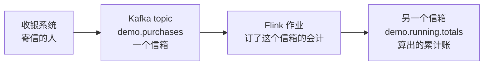
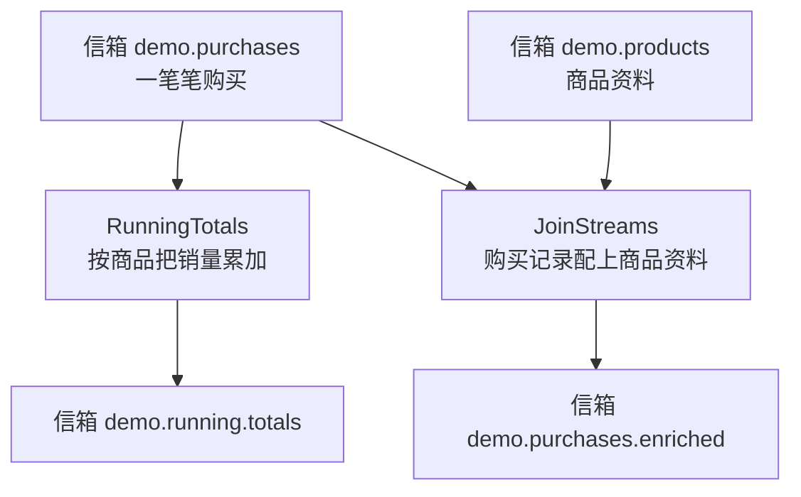
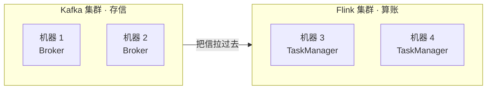
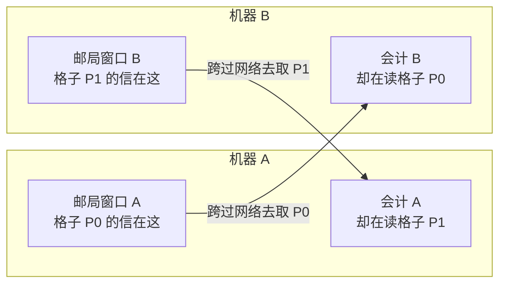
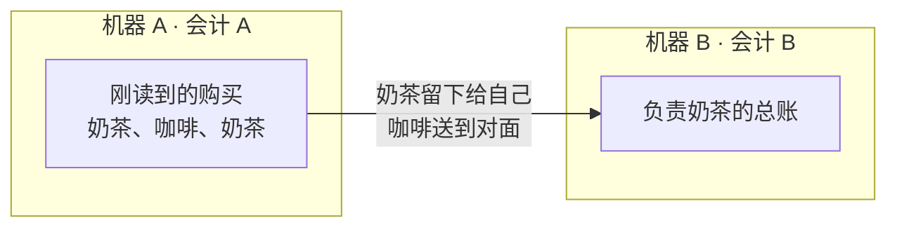
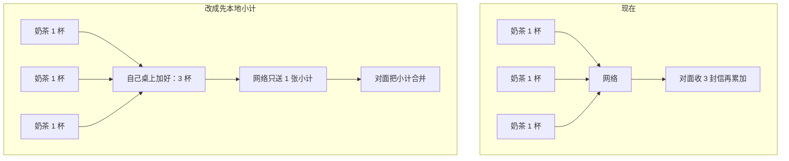

# 看图理解：Flink 怎么读 Kafka

把 Kafka 想成邮局，把 Flink 想成订了某个信箱的会计。会计只读信、算账，不改邮局，也不改寄信的人。

先读这篇会更容易：[统计销量，为什么不直接用数据库？](database-vs-flink.md)

## 1. 谁干什么

信箱里的原信还在。会计另外开一个信箱，把算好的结果投进去。

本仓库有两个会计：

订哪个信箱，写在 `src/main/resources/config.properties` 里。换一套 Kafka，改地址和信箱名就行。

## 2. 两套集群各管各的

Kafka 集群负责把信存好。Flink 集群负责算账。它们可以装在不同的机器上。

一台 Kafka 机器不必配一台 Flink 机器。邮局人少、会计人多，或反过来，都可以。放在同一个机房就够了，免得信件跨城市跑。

## 3. 信放在一起，也不会少跑腿

就算 Kafka 和 Flink 装在同一批机器上，读信的人也不一定就站在信箱旁边。

下面两台机器，每台都有一个邮局窗口（Broker）和一个会计（TaskManager）。P0、P1 是同一个信箱里的两个格子。

谁读哪个格子，是临时分的，不看信实际放在哪台机器。所以大多数信还是要从一台机器搬到另一台。碰巧分到同一台时，才走机器内部，省掉网线那一跳。

## 4. 算账时还会再搬一次

`RunningTotals` 要按商品编号把账加在一起。同一个商品的信，必须送到同一个会计手上。这一步叫 `keyBy`。

这次搬家发生在两个会计之间，和邮局在不在旁边无关。

一条购买记录的完整路线：

第 1 跳有时碰巧在本机。第 2 跳只要两个会计不在同一台机器，就一定过网络。

## 5. 想少搬，就少寄信

现在每买一杯，就寄一封信过去做累加。可以让每个会计先在自己桌上把同一商品加一加，过一会儿只寄一张小计。

购买越多、商品种类越少，省下的网络越多。本仓库现在用的是左边这种，每笔都送。
